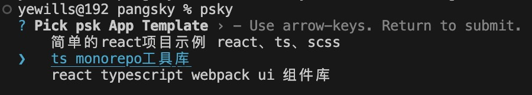

# psky
psky，盘古(pangu)开天(sky)，引申为创建、生成之意。<br>
目前用于管理和生成项目模版、脚手架模版、ui组件库模版。<br>
本工程采用monorepo方式，可以很方便的集成更多工具。
>本工程是一个企业级的monorepo工程范例，利用了turbo的缓存编译，让开发编译速度更加快捷, 同时，工程包含了完整的开发、编译、发布、husky、文档集成。

## 内置模版
每个公司都需要一个monorepo式的工具库，一个ui组件库。

### 企业级monorepo工具库
开箱即用，工程包含了完整的开发、编译、发布、husky、文档集成。<br>可以轻松集成公司的所有工具包，并且使用统一的命名空间，方便npm包管理。<br>
同时利用了turbo的缓存编译，让开发编译速度更加快捷。
>这是一套经典的monorepo库范例，借鉴了umi源码和next.js源码

技术栈：
- 主体:monorepo + lerna + turbo + pnpm + workspaces + typescript
- 文档:dumi
- 调试:yalc


### 企业级ui组件库框架
开箱即用，工程包含了完整的开发、编译、发布、husky、文档集成、example调试。<br>
ui组件库要解决的难点：
- 如何生成文档，文档中可以展示demo示例并可查看源码，这里使用了dumi方案；
- 如何进行example调试，也可以通过文档实现，不过会比较重，这里另写了一套webpack配置用于测试demo，非常轻量便捷

技术栈：
- 主体:typescript + react + webpack5 + pnpm
- 文档:dumi

## 两大优点
相比一般的`create cli`，psky多了两大优点：
- 集成模版非常方便，可以很方便地集成来自git仓库的模版，和内置模版一起使用。
- 集成了本地项目管理能力：
  - psky会记录所有通过psky生成的项目，以便查看；
  - 通过psky生成的项目，下次要生成相同项目时，会提示是否要打开之前的项目或者继续生成新项目；
  - 通过这些能力，尤其在做demo测试时，让你不需要重复安装项目，就可快速进行demo测试，同时也让你的工作区干净整洁

## 使用
```s
#需要切到node 16版本
npm i psky -g
psky my-app
#根据提示选择要使用的模版生成项目
```

## 模版
内置模版，在`packages/pangsky/templates`中，为了方便集成更多模版，另外的模版放到[psky-template](https://gitee.com/mayising/psky-template.git)上维护。

## 集成模版
本工具可以很方便地集成更多模版，执行下面命令：
```s
psky config get
```
获取模版配置文件`tplList.json`,修改文件如下，集成管理自己的模版：
`repository`是模版仓库地址 gitee，因为下载流畅。
```json
{
  "tplList": [
    {
      "title": "一个模版描述",
      "repository": "https://gitee.com/mayising/tpltest"
    }
  ]
}
```
假如模版在仓库某个路径下，则配置为：
```json
{
  "tplList": [
    {
      "title": "一个模版描述",
      "repository": "https://gitee.com/mayising/tpltest",
      "path": "/react-demo"
    }
  ]
}
```

## 开发
### 安装与构建
根目录下执行 `pnpm i && pnpm build`

### 调试

#### 通过yalc调试
本项目根目录下执行
```s
pnpm run build
pnpm run yalc
```

在其他任意一个目录下创建调试项目：
```s
mkdir psky-debug
cd psky-debug
npm init
yalc add psky @pskyjs/utils
```
使用过程如果有报错，可能要再安装`psky` `@pskyjs/utils` 依赖的下面两个包：
```s
npm i ora@5.4.1 chalk@4.1.2 git-clone@0.2.0
```
后续更新时，本项目根目录下执行
```s
pnpm run build
pnpm run yalc
```
调试项目
```s
yalc update
```


后续即可进行开发调试了，在调试项目下：
```s
mkdir test
cd test
node ../node_modules/psky/bin/create-psky.js
```


#### 通过局部psky命令调试
在其他任意一个目录下创建调试项目：
```s
mkdir psky-debug
npm init
npm i psky
mkdir test
cd test
npx psky
```


### 发布
```s
pnpm run release #正式发布
```
```s
pnpm run release --soon #快速发布，不提交github
```
